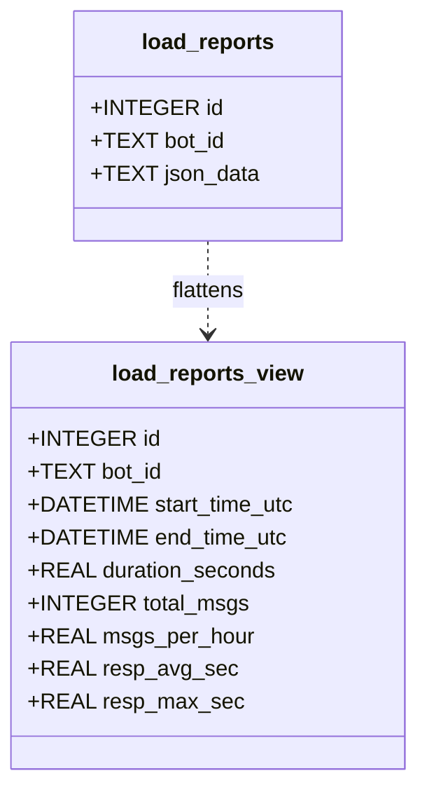
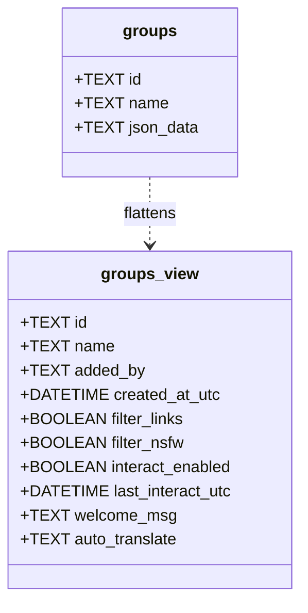
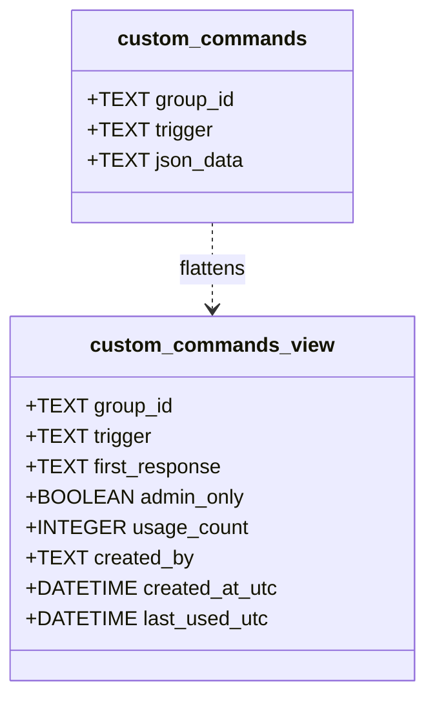
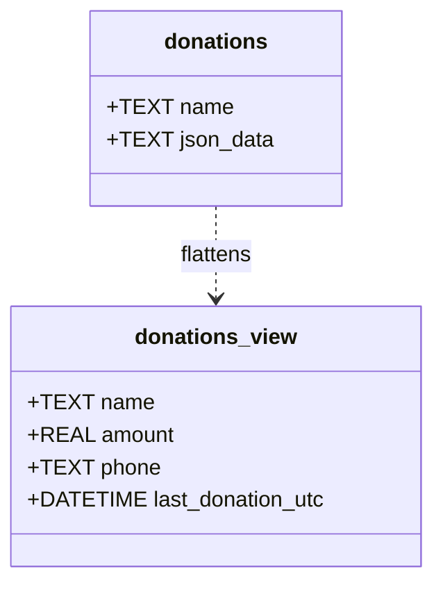
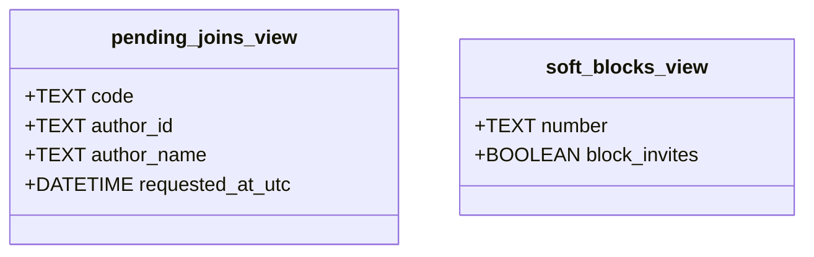
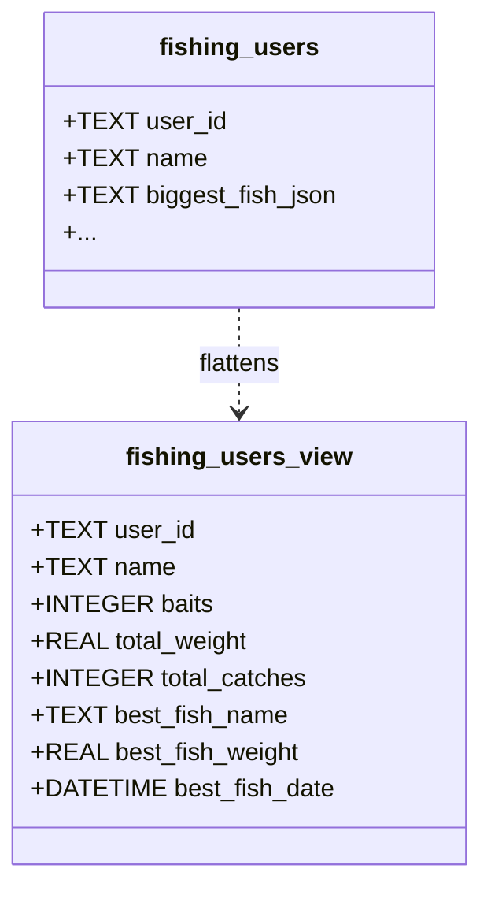

# Databases Documentation

This project uses a hybrid data storage approach. structured and heavy data is stored in **SQLite** databases located in `data/sqlites/`.

To facilitate data analysis, we have created **SQL Views** in the key databases. These views "flatten" the JSON content stored in columns like `json_data` into standard columns.

## 🧠 Core Database
**File:** `data/sqlites/core.db`

### `load_reports`
Bot performance metrics.


```sql
CREATE VIEW IF NOT EXISTS load_reports_view AS SELECT id, bot_id, datetime(json_extract(json_data, '$.period.start')/1000, 'unixepoch') as start_time_utc, ... FROM load_reports;
```

### `groups`
Group configurations.


```sql
CREATE VIEW IF NOT EXISTS groups_view AS SELECT id, name, json_extract(json_data, '$.addedBy') as added_by, ... FROM groups;
```

### `custom_commands`
User-created commands.


```sql
CREATE VIEW IF NOT EXISTS custom_commands_view AS SELECT group_id, trigger, json_extract(json_data, '$.responses[0]') as first_response, ... FROM custom_commands;
```

### `donations`
Donation tracking.


```sql
CREATE VIEW IF NOT EXISTS donations_view AS SELECT name, json_extract(json_data, '$.valor') as amount, ... FROM donations;
```

### `pending_joins` & `soft_blocks`
Access control and requests.



## 🎣 Fishing Game
**File:** `data/sqlites/fishing.db`

### `fishing_users`


```sql
CREATE VIEW IF NOT EXISTS fishing_users_view AS SELECT user_id, name, baits, total_weight, total_catches, json_extract(biggest_fish_json, '$.name') as best_fish_name, ... FROM fishing_users;
```

## 📊 Standard Databases (No Views Needed)

*   **`cmd_usage.db`**: `cmd_usage_log` (Usage history)
*   **`msgranking.db`**: `ranking` (Message counts)
*   **`media_stats.db`**: `comfy_stats`, `speech_transcription_stats`
*   **`llm_stats.db`**: `usage_stats` (Token usage)

For full SQL definitions, see `DATABASE_VIEWS.md`.